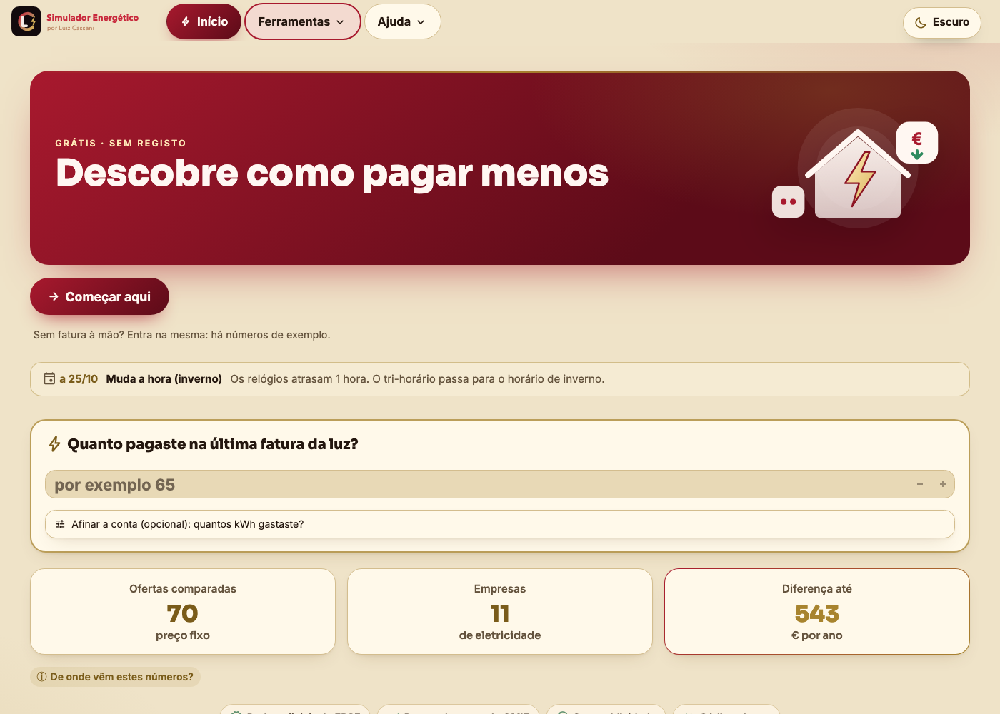
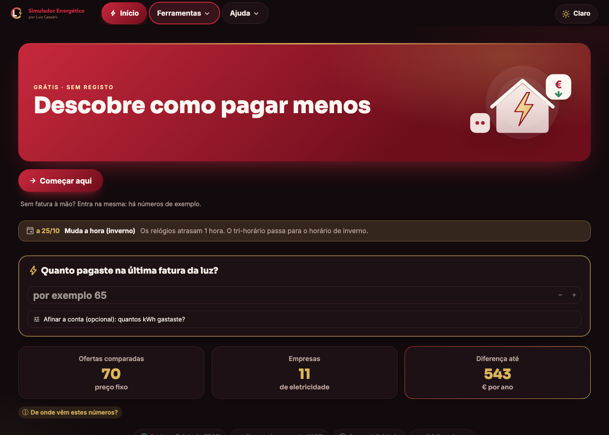
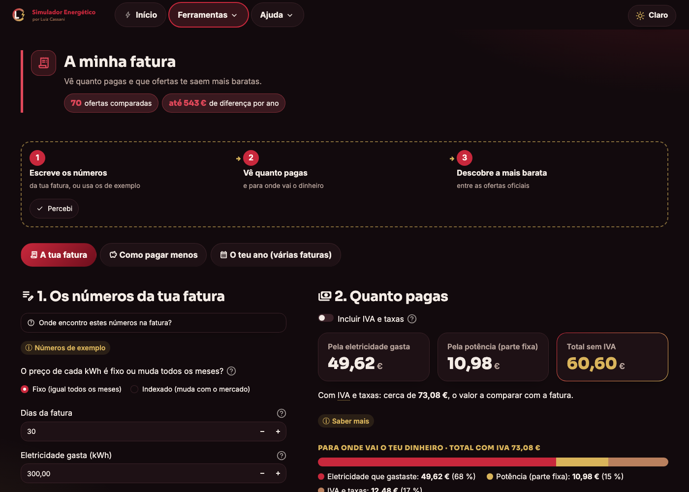
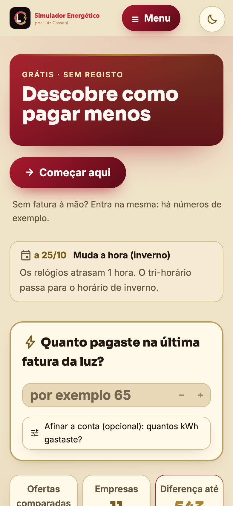

# Simulador Energético (Energy Bill Simulator)

[](https://github.com/Felipecassani/simulador-energetico/actions/workflows/testes.yml)

*Versão em português: [README.md](README.md)*

A free website that helps anyone in Portugal understand their electricity bill and find out whether they could pay less. The site itself is in Portuguese.

**Try it:** https://simulador-energetico-8ufymt75zojdygw4tfgxjm.streamlit.app

<p>
  
  
</p>
<p>
  
  
</p>

## Why I built it

An electricity bill is full of jargon (contracted power, kVA, off-peak, indexed prices, network tariffs…) and most people can't tell whether they are overpaying. I wanted a simple tool: you type four numbers from your bill and see what you pay, where the money goes and which offers would be cheaper. No sign-up and no ads.

## What the site does

- **My bill:** reads the bill from a PDF (or you fill it in by hand), shows the total with VAT and fees and compares it with the offers on the market. If you don't have the bill at hand, you can estimate your consumption from your appliances.
- **Save at home:** tips chosen for each household and how much they save.
- **Compare offers:** the roughly 70 offers published by ERSE (the Portuguese energy regulator), from cheapest to most expensive, for your consumption.
- **Hourly price:** today's and tomorrow's price on the Iberian electricity market (OMIE).
- **Is a two-rate tariff worth it?:** compares single, two-rate and three-rate tariffs against when you use electricity.

The home page has a quick calculator: type what you paid on your last bill and it estimates how much you could save per year.

## How the code is organised

```
simulador-energia/
  app.py        site entry point: menu, theme and the selected page
  nucleo/       the calculations (plain Python, no Streamlit)
  interface/    colours, styling and reusable visual pieces
  paginas/      one page per tool, plus Home and Help
  tests/        automated tests
  assets/       logo and illustrations
```

I kept the calculations (`nucleo/`) apart from what you see on screen (`interface/` and `paginas/`). That way I can test the maths without opening the site, and change the look without touching the maths.

## A few details

- **Real numbers.** Prices come from official sources: ERSE tariffs and offers, and daily OMIE market prices. VAT and fees were checked against a real bill and the total matches to the cent.
- **Tested.** 228 tests compare the calculations with sums done by hand and open every page to check it doesn't crash. They run on GitHub on every push.
- **For people who know nothing about energy.** Technical words are underlined and explained on hover. Details are tucked away behind an «ⓘ».
- **Privacy.** The bill is read in memory to fill in the fields and is never stored.
- **Light and dark themes**, designed for phones too.
- **Share card:** an image with the savings and a QR code that opens the site.

## Tech

Python, Streamlit, pandas, Plotly, pypdf (reading bills), reportlab (PDF summary), Pillow and segno (QR share card) and pytest, with GitHub Actions running the tests.

## Run it locally

```bash
git clone https://github.com/Felipecassani/simulador-energetico.git
cd simulador-energetico
python3 -m venv .venv
.venv/bin/pip install -r requirements.txt
cd simulador-energia
../.venv/bin/python -m streamlit run app.py
```

To run the tests, from inside `simulador-energia`:

```bash
../.venv/bin/python -m pytest
```

## How I made it

Most of the heavy lifting in the code was written with the help of Claude Code. My part was deciding what the site should do, checking the calculations against real bills, and reviewing and fixing parts of the code and the site.

The project isn't finished: some sections are still to be built, and there are parts of the code I want to rewrite my own way.

## Next steps

- Rewrite the smaller files in `nucleo/` my own way, starting with `relampago.py` (the quick calculator) and `aparelhos.py` (appliance consumption). Both have their own tests, so I can change the code and confirm with `pytest` that the numbers still add up.
- Then move on to the rest of `nucleo/` and the pages, one file at a time.
- Finish the sections that are still hidden from the menu (gas, solar panels, production, Europe…).

The commit history shows this progress.

## Author

Luiz Cassani · [LinkedIn](https://www.linkedin.com/in/luizfelipecassani/) · [GitHub](https://github.com/Felipecassani) · cassaniluizfelipe@gmail.com
